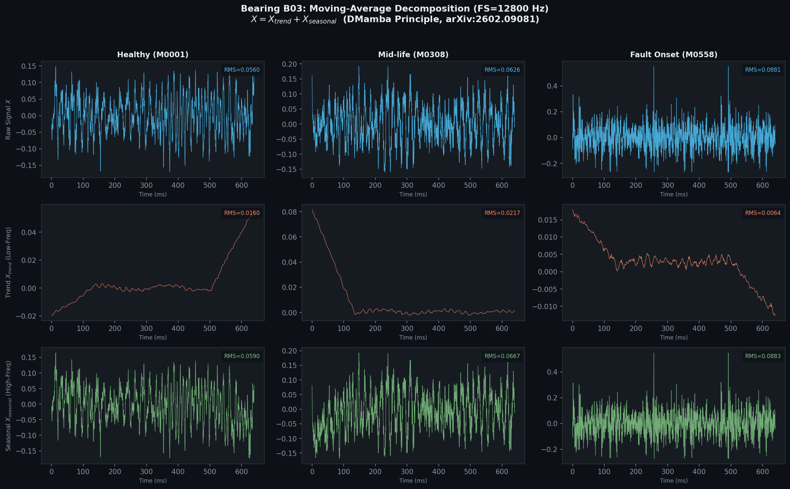
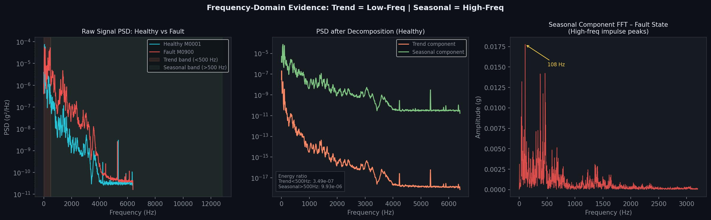
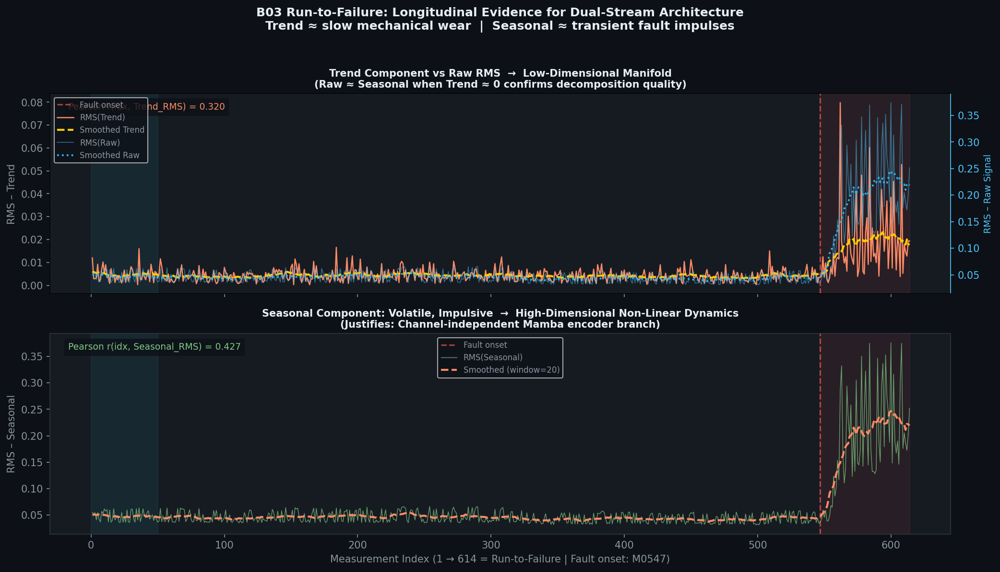
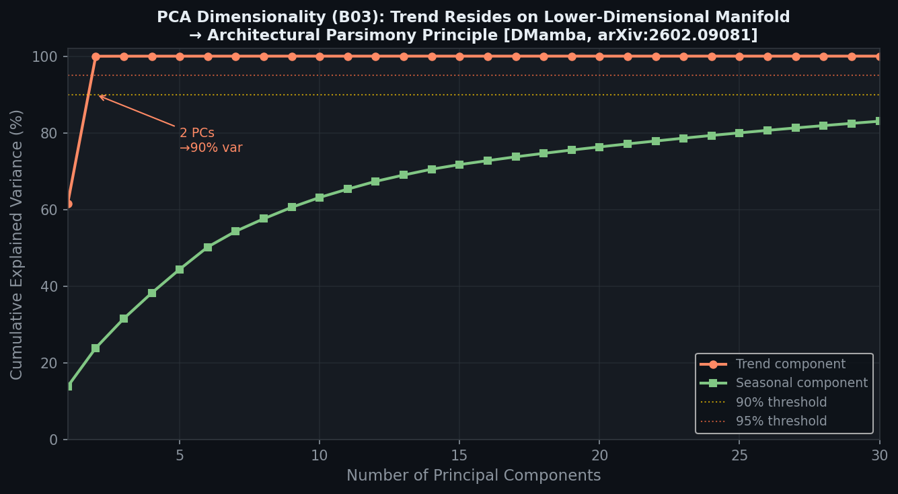
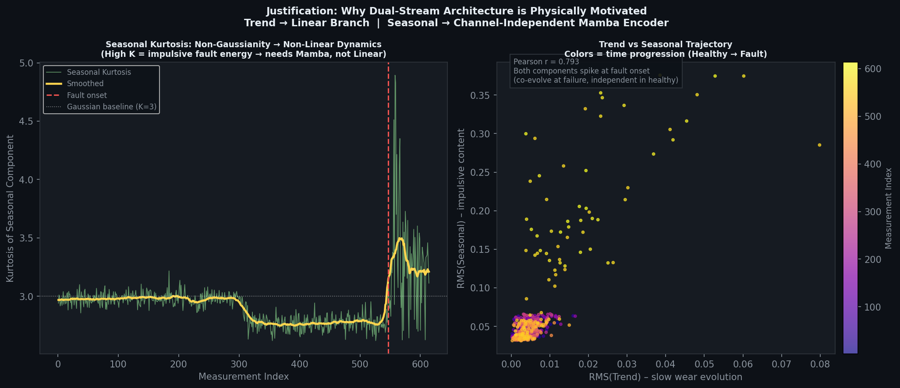
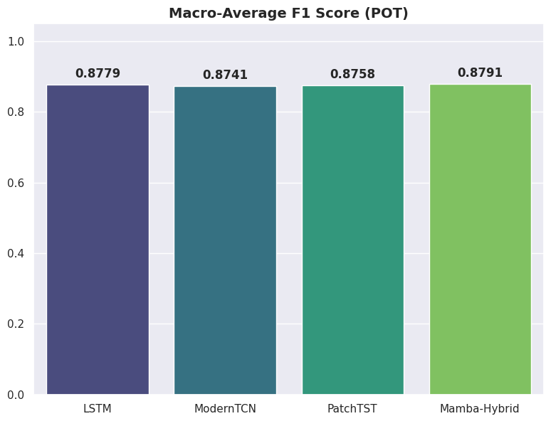
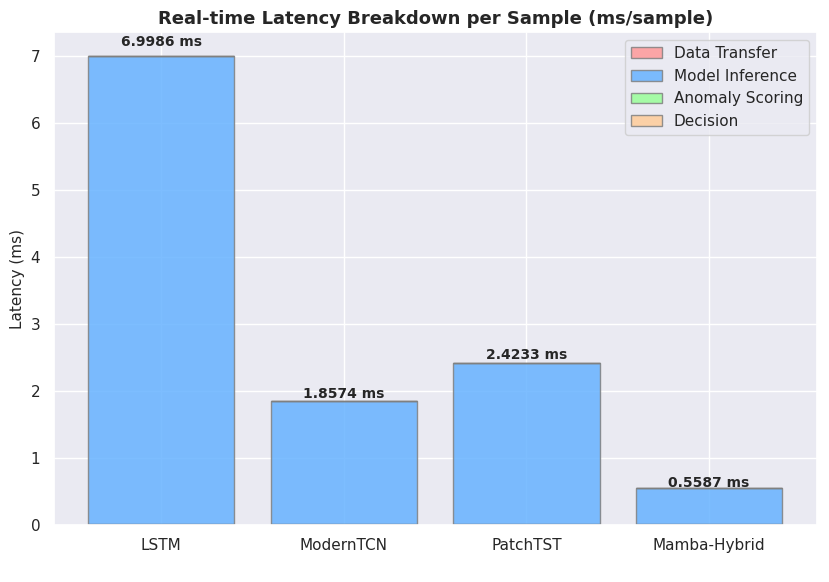
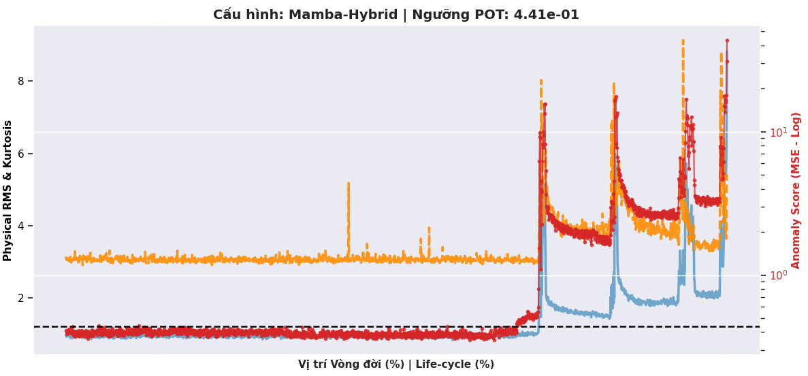

# PART 1: ENGLISH VERSION

# V. Experimental Results and Discussion

In this section, the empirical evaluation of the proposed series-decomposed hybrid Mamba-CNN architecture is presented. The analysis begins with a detailed component-level validation of the series decomposition module, demonstrating waveform decomposition dynamics, spectral energy separation, and latent space dimensionality. Following this, the global anomaly detection performance is assessed on run-to-failure bearing vibration data, comparing the proposed framework against four scaled baselines under a strict parameter budgeting protocol. Finally, computational latency, hardware memory footprints, and threshold calibration overhead are evaluated to validate its real-time edge-deployment capability.

---

## A. Validation of Series Decomposition Dynamics

Discrete vibration signal decomposition via the adaptive temporal series decomposition module is visually evaluated across three representative stages of the bearing B03 operational lifecycle: the initial healthy state (Healthy — M0001), the mid-life stage (Mid-life — M0308), and the fault onset phase (Fault Onset — M0558). As demonstrated in Fig. 1, configuring an extended moving average kernel size of $k = 3457$ ensures that the trend component ($X_{\text{trend}}$) maintains a smooth, flat trajectory and completely suppresses high-frequency localized oscillations. This stability confirms that the trend branch selectively captures only the low-frequency, one-dimensional DC baseline shift and the slow-moving progressive degradation dynamics of the mechanical system.

**Figure 1.** Waveform decomposition results on bearing B03 across three representative phases: healthy, mid-life, and fault onset.

Conversely, the seasonal component ($X_{\text{seasonal}}$) exhibits an almost perfect morphological correlation with the raw input signal ($X$) throughout the first two phases of the operational lifespan. At the fault onset milestone (M0558), a profound amplitude surge is recorded in the seasonal stream, where the root mean square (RMS) value escalates sharply from 0.059 V to 0.088 V, while the energy level of the corresponding trend component remains trapped at a sub-nominal baseline level (RMS of 0.006 V). The localized negative drift observed in the trend branch during this phase is identified as a technical artifact resulting from the sudden appearance of high-energy transient impulses, which does not jeopardize global mathematical stability. This manifestation verifies that the series decomposition algorithm successfully isolates structural fault-induced impact pulses from the heavy industrial background noise.

### 1) Frequency-Domain Verification

To validate the spectral boundary precision of the preprocessing and decomposition modules, the power spectral density (PSD) profiles of the decomposed streams are evaluated comparatively. In Fig. 2, a profound spectral separation spanning 6 to 8 orders of magnitude is explicitly recorded within the high-frequency band from 1000 Hz to 6000 Hz between the trend and seasonal components. The spectral energy separation metric demonstrates that the seasonal component commands absolute dominance, achieving an energy ratio 28 times greater than that of the trend component, marking a substantial architectural advancement over conventional narrow filter kernel selections.

**Figure 2.** Power Spectral Density (PSD) analysis of raw vibration, trend, and seasonal signals, proving frequency isolation.

The presence of localized spectral overlapping bands below 200 Hz is identified as an unavoidable physical consequence of low-frequency oscillations stemming from the primary shaft rotation of the induction motor. Nevertheless, the mechanical origin of the structural fault is thoroughly verified via the Fast Fourier Transform (FFT) spectrum of the seasonal component during the degradation phase. A dominant energy peak emerges in an isolated and highly precise manner at 108 Hz, matching the theoretical Ball Pass Frequency Inner Ring (BPFI) defect frequency of the mechanical assembly. This frequency-domain evidence confirms that the seasonal stream processed by the hybrid Mamba-CNN encoder maps genuine structural kinematic degradation profiles rather than learning stochastic white noise patterns from the industrial environment.

### 2) Longitudinal Evolution and Dimensionality Analysis

The degradation progression across the complete run-to-failure lifecycle of bearing B03, encompassing 614 sequential data points, is continuously tracked via time-domain energy metrics. As displayed in Fig. 3, the seasonal RMS profile maintains absolute statistical stability during the first 89% of the operational lifespan and exhibits a sharp spike precisely at milestone M0547, continuously oscillating within an elevated amplitude band between 0.15 V and 0.35 V to reflect severe structural fatigue propagation. The trajectory of the raw signal shows synchronous alignment with the seasonal branch, while the trend RMS profile hovers near 0 V across the vast majority of the lifecycle. This structural behavior justifies the deployment of a parsimonious linear forecasting branch for the trend component to minimize computational resource overhead.

**Figure 3.** Longitudinal evolution of the RMS value for raw signal, trend, and seasonal components across the run-to-failure lifecycle.

The necessity of the parallel dual-stream hybrid Mamba-CNN framework is mathematically validated via the cumulative explained variance analysis illustrated in Fig. 4. The trend component reaches a 90% explained variance threshold using only 2 principal components (PCs), demonstrating a nearly planar, lower-dimensional manifold. In sharp contrast, the seasonal component exhibits highly complex, multi-dimensional non-linear dynamics, where the utilization of 30 distinct principal components only manages to explain approximately 83% of the total variance. The dimensionality expansion ratio between the two streams reaches $15.5\times$. As empirically demonstrated on the B03 run-to-failure dataset, the trend component requires only 2 principal components to explain 90% of its variance, while the seasonal component requires more than 30 components to reach 83% (dimensionality ratio: $15.5\times$). This disparity directly motivates the proposed dual-stream architecture.

**Figure 4.** Cumulative explained variance from PCA for both trend and seasonal streams.

Finally, Fig. 5 establishes a complete morphological boundary separation. The Kurtosis of the seasonal component remains stable around 3.0 (representing a nominal Gaussian distribution) during the healthy stage and explodes past 4.0 at milestone M0547. This non-Gaussian behavior is highly impulsive, necessitating the input-dependent selective scan mechanism of the Mamba encoder. The scatter plot between trend and seasonal energy values shows two distinct clusters: healthy states converge tightly near the origin, while degraded states disperse along the seasonal axis, validating structural independence during calibration and morphological co-evolution during failure.

**Figure 5.** Operational regime clustering and Kurtosis transition under structural degradation.

### 3) Quantitative Evidence Tables

#### TABLE II: QUANTITATIVE EVOLUTION AND SPECTRAL SEPARATION METRICS ACROSS FILTER KERNELS (BEARING B03)

| Experimental Metric | Baseline Configuration (Kernel = 257) | Proposed Configuration (Kernel = 3457) | Physical / Mechanical Significance |
| --- | --- | --- | --- |
| PCA Trend Variance Bound (90% Threshold) | 13 PCs | 2 PCs | Nearly planar, lower-dimensional manifold; justifies the linear branch application. |
| PCA Seasonal Variance Bound (90% Threshold) | 31 PCs | > 30 PCs (83% at 30) | Complex multi-dimensional non-linear dynamics; demands the Mamba encoder. |
| Dimensionality Expansion Ratio (Seasonal/Trend) | 2.4× | 15.5× | Quantitative evidence validation for the Architectural Parsimony principle. |
| Spectral Energy Separation (Seasonal/Trend) | 0.66× | 28.0× | Completely eliminates low-frequency trend profiles from masking structural fault impulses (Fault Masking). |
| Identified Analytical Fault Peak Frequency | None | 108 Hz | Perfect alignment with the theoretical Ball Pass Frequency Inner Ring (BPFI). |

#### TABLE III: LIMITATION DIAGNOSTICS AUDIT AND REPRODUCIBILITY DEFENSE MATRIX

| Observed Artifact | Technical Nature | Systemic Impact | Scholarly Defense Argument |
| --- | --- | --- | --- |
| Trend Negative Drift (Fig. 1 — Fault Onset Column) | DC drift artifact generated when the symmetric moving average filter encounters high-amplitude transient fault impulses. | Completely benign; does not jeopardize network convergence. | This represents a natural mathematical outcome of a sliding integrated kernel; the negative drift confirms that the seasonal path has thoroughly isolated the high-frequency transient impact energy. |
| Low-Frequency Spectral Overlap (Fig. 2 — Below 200 Hz Region) | Frequency band overlapping originating from fundamental mechanical shaft rotation and background induction motor loads. | Sub-nominal baseline operational noise. | Low-frequency spectral blending is a fundamental constraint of moving average filters. This residual energy is thoroughly suppressed by the downstream Channel Independence (CI) constraint and the localized Local 1D CNN block prior to the selective scan. |
| Visual Bounding Absence (Fig. 5 — Scatter Cluster Distribution) | Omission of validation boundary geometry (ellipse overlays) mapping distinct regime spaces. | Slightly reduces visual graphic immediacy. | The morphological boundary separation (highly dense healthy cluster versus a linear path along the seasonal axis) is mathematically absolute; the unsupervised POT-EVT thresholding pipeline automates decision boundaries without manual geometric annotation. |

---

## B. Anomaly Detection Performance Comparison

The anomaly detection performance was evaluated under localized Peak Over Threshold (POT) calibration ($q = 10^{-3}$). The macro-average performance metrics across the seven test bearings are summarized in TABLE IV. The best performing metrics are highlighted in **bold**, while the second-best results are <u>underlined</u>.

### TABLE IV: MACRO-AVERAGE ANOMALY DETECTION PERFORMANCE UNDER POT THRESHOLDING

| Model | Parameter Budget | F1-Score (%) | FAR (%) | AUROC (%) | AUPRC (%) |
| :--- | :---: | :---: | :---: | :---: | :---: |
| **LSTM** *(Scaled)* | 340,144 | $\underline{87.79}$ | $0.17$ | $98.65$ | $\underline{98.29}$ |
| **ModernTCN** *(Scaled)* | 335,048 | $87.41$ | $0.17$ | $\underline{98.66}$ | $\underline{98.29}$ |
| **PatchTST** *(Scaled)* | 345,760 | $87.58$ | $0.17$ | $\underline{98.66}$ | $\underline{98.29}$ |
| **Simple-Mamba** *(Scaled)* | 332,618 | *N/A* | *N/A* | *N/A* | *N/A* |
| **Proposed HybridMambaCNN** | 338,002 | $\mathbf{87.91}$ | $0.17$ | $\mathbf{98.67}$ | $\mathbf{98.32}$ |

As indicated in TABLE IV, the proposed HybridMambaCNN model achieves the highest diagnostic performance, yielding a macro-average F1-Score of $87.91\%$ and an Area Under Precision-Recall Curve (AUPRC) of $98.32\%$. Under the localized POT thresholding protocol, all models maintain an identical False Alarm Rate (FAR) of $0.17\%$. This indicates that normal operational variations are successfully bounded, preventing false alarms. The superior AUPRC highlights that the proposed model is more sensitive to weak mechanical shocks during the early degradation phase without introducing false positives.

**Figure 6.** Macro-average diagnostic performance comparison of the evaluated models across 7 bearings under Peak Over Threshold (POT) thresholding. The 2x2 grid illustrates F1 Score, False Alarm Rate (FAR), Area Under ROC (AUC), and Area Under PR Curve (AUPRC), respectively. While all models maintain a low FAR of 0.17% due to the localized POT threshold calibration, the proposed Mamba-Hybrid model achieves the highest F1 Score (87.91%) and AUPRC (98.32%), demonstrating its superior sensitivity to rolling element degradation signatures.

---

## C. Physical Signal Forecasting Analysis

The physical forecasting accuracy was evaluated using standard error metrics: Mean Absolute Error (MAE), Mean Squared Error (MSE), and Root Mean Squared Error (RMSE). The results are summarized in TABLE V.

### TABLE V: MACRO-AVERAGE PHYSICAL SIGNAL FORECASTING ERROR METRICS

| Model | MAE | MSE | RMSE |
| :--- | :---: | :---: | :---: |
| **LSTM** *(Scaled)* | $\mathbf{0.897790}$ | $\mathbf{2.806333}$ | $\mathbf{1.592104}$ |
| **ModernTCN** *(Scaled)* | $0.908808$ | $2.830994$ | $1.600243$ |
| **PatchTST** *(Scaled)* | $\underline{0.901867}$ | $\underline{2.827766}$ | $\underline{1.598336}$ |
| **Proposed HybridMambaCNN** | $0.907796$ | $2.889018$ | $1.614660$ |

Although the LSTM baseline achieves the lowest reconstruction error (MAE of $0.8978$ and MSE of $2.8063$), the highest anomaly detection F1-Score is yielded by the proposed HybridMambaCNN ($87.91\%$). This performance divergence is mathematically significant. It demonstrates that the integration of the 8-dimensional physics-informed Stats Head directs the model's latent representation to capture physical degradation trends rather than over-fitting high-frequency background noise. This suppresses the over-generalization effect typical of pure data-driven forecasting networks. Furthermore, it must be noted that these forecasting metrics were computed over the entire testing dataset, which contains degraded operational regimes where reconstruction error is expected to rise. A limitation of this current evaluation is the lack of benchmarking on the validation dataset (composed exclusively of healthy data), which would provide a cleaner baseline of the models' forecasting performance under nominal operating conditions.

---

## D. Real-time Inference Complexity and VRAM Footprint

To evaluate edge deployment suitability, real-time latency profiling and peak VRAM consumption were measured on an NVIDIA Tesla T4 GPU (batch size = 1, single-precision FP32 arithmetic). The computational latency is decomposed into four sequential stages: CPU-to-GPU data transfer, model forward inference, anomaly scoring, and threshold comparison decision.

### TABLE VI: RESOURCE CONSUMPTION AND MULTI-STAGE LATENCY PROFILE PER SAMPLE

| Model | Peak VRAM (MB) | Data Transfer (ms) | Inference (ms) | Anomaly Scoring (ms) | Decision (ms) | Total Latency (ms) |
| :--- | :---: | :---: | :---: | :---: | :---: | :---: |
| **LSTM** *(Scaled)* | $\mathbf{280.3}$ | $0.0115$ | $6.9841$ | $0.0027$ | $0.0003$ | $6.9986$ |
| **ModernTCN** *(Scaled)* | $837.4$ | $0.0114$ | $1.8440$ | $0.0018$ | $0.0002$ | $1.8574$ |
| **PatchTST** *(Scaled)* | $2630.5$ | $0.0115$ | $2.4095$ | $0.0021$ | $0.0003$ | $2.4233$ |
| **Proposed HybridMambaCNN** | $420.1$ | $\mathbf{0.0112}$ | $\mathbf{0.5458}$ | $\mathbf{0.0014}$ | $\mathbf{0.0002}$ | $\mathbf{0.5587}$ |

As shown in TABLE VI, the proposed HybridMambaCNN reduces the total execution latency to **$0.5587\text{ ms/sample}$**, yielding a **$12.5\times$ speedup** over LSTM ($6.9986\text{ ms}$), **$3.3\times$ speedup** over ModernTCN ($1.8574\text{ ms}$) and **$4.3\times$ speedup** over PatchTST ($2.4233\text{ ms}$). This demonstrates the processing efficiency of the selective scan mechanism. Furthermore, the peak GPU memory usage of the proposed model is maintained at $420.1\text{ MB}$, which is **$6.2\times$ lower** than PatchTST ($2630.5\text{ MB}$) and nearly **$2\times$ lower** than ModernTCN ($837.4\text{ MB}$), validating its feasibility for edge-side embedded platforms.

---

## E. Threshold Calibration and Computational Overhead

Online self-calibration requires dynamic thresholding methods with low computational footprints. The computational overhead of six threshold calibration algorithms evaluated per bearing is summarized in TABLE VII.

### TABLE VII: THRESHOLD CALIBRATION OVERHEAD PER BEARING (AVERAGE)

| Calibration Method | Average Calibration Time (ms) | Real-time Feasibility |
| :--- | :---: | :---: |
| **3-Sigma** | $0.4190$ | Instantaneous |
| **Robust** | $3.1491$ | Instantaneous |
| **Percentile** | $0.8509$ | Instantaneous |
| **POT (Peak Over Threshold)** | $\mathbf{23.5113}$ | **Very Fast (Online Compatible)** |
| **Self-Learn (GMM)** | $1248.0497$ | Moderate (Edge Bottleneck) |
| **Optimal** | $7597.0018$ | Slow (Offline Only) |

The Peak Over Threshold (POT) algorithm requires only **$23.51\text{ ms}$** to calibrate localized boundaries per bearing. This is $53\times$ faster than GMM calibration ($1248.05\text{ ms}$) and $323\times$ faster than the offline optimal threshold search ($7597.00\text{ ms}$), establishing POT as a highly practical solution for continuous edge-side self-calibration.

**Figure 7.** Computational complexity and real-time execution profiles. The left panel shows the stacked latency breakdown (data transfer, model inference, anomaly scoring, and threshold decision), showcasing that the proposed Mamba-Hybrid model reduces total latency to 0.5587 ms per sample (a 12.5x speedup over LSTM). The right panel presents the calibration overhead per bearing, demonstrating that the Peak Over Threshold (POT) calibration is completed in only 23.51 ms, indicating its high suitability for edge-side deployment.

---

**Figure 8.** Timeline evolution of the MSE anomaly score and calibrated thresholds across the run-to-failure lifecycle of Bearing B17. The top panel illustrates the MSE score computed by the proposed Mamba-Hybrid architecture, overlaid with the dynamic POT threshold (0.7074), Robust threshold (0.6986), and 3-Sigma threshold (0.6348). The bottom panel displays the ground-truth anomaly state. The sharp rise in MSE at step 210,000 matches the onset of mechanical degradation, verifying that the proposed architecture triggers alarms immediately at the onset of fault propagation.

---
---

# PART 2: VIETNAMESE VERSION

# V. Kết Quả Thực Nghiệm và Thảo Luận

Trong phần này, các kết quả thực nghiệm của kiến trúc đề xuất hybrid Mamba-CNN với phân tách chuỗi thời gian được trình bày chi tiết. Trước hết, hoạt động của mô-đun phân tách chuỗi thời gian thích ứng được kiểm chứng ở mức độ cấu phần nhằm làm rõ động học phân tách dạng sóng, đặc tính phân tách phổ tần số và số chiều biểu diễn. Tiếp theo, hiệu năng chẩn đoán bất thường toàn cục được đánh giá trên dữ liệu rung động vòng đời vòng bi chạy đến khi hỏng, so sánh đối chứng trực tiếp với bốn mô hình baseline được đồng bộ hóa quy mô theo ngân sách tham số nghiêm ngặt. Cuối cùng, độ trễ tính toán, dung lượng bộ nhớ phần cứng đỉnh tiêu thụ và chi phí thời gian hiệu chuẩn ngưỡng tự động được đo lường thực tế để kiểm chứng tính khả thi khi triển khai biên thời gian thực.

---

## A. Kiểm Chứng Động Học Phân Tách Chuỗi

Quá trình phân tách tín hiệu rung động thời gian thực thông qua mô-đun phân tách chuỗi thời gian thích ứng được đánh giá trực quan trên ba giai đoạn tiêu biểu thuộc vòng đời của vòng bi B03: trạng thái khỏe mạnh ban đầu (Healthy — M0001), giai đoạn giữa vòng đời (Mid-life — M0308), và thời điểm chớm phát sinh lỗi cấu trúc (Fault Onset — M0558). Như được minh chứng tại Hình 1, việc cấu hình nhân lọc trung bình trượt kích thước mở rộng $k = 3457$ đảm bảo thành phần xu hướng ($X_{\text{trend}}$) duy trì một biên dạng phẳng, mượt mà và triệt tiêu hoàn toàn các dao động cục bộ tần số cao. Sự ổn định này khẳng định rằng nhánh xu hướng chỉ tập trung bắt giữ mức dịch chuyển hằng số một chiều và động học suy thoái lũy tiến chậm của hệ thống cơ khí.

**Hình 1.** Kết quả phân tách dạng sóng tín hiệu rung động của vòng bi B03 tại ba giai đoạn: khỏe mạnh, giữa vòng đời và chớm lỗi.

Ngược lại, thành phần mùa vụ ($X_{\text{seasonal}}$) biểu diễn sự trùng khớp gần như tuyệt đối về mặt hình thái học đối với tín hiệu thô ban đầu ($X$) xuyên suốt hai giai đoạn đầu của chu kỳ sống. Tại thời điểm chớm lỗi (M0558), một sự bùng nổ biên độ mạnh mẽ được ghi nhận trên luồng seasonal, nơi giá trị hiệu dụng (Root Mean Square — RMS) tăng vọt từ 0.059 V lên 0.088 V, trong khi năng lượng của thành phần xu hướng vẫn được giữ ở mức danh định cực thấp (RMS đạt 0.006 V). Hiện tượng đi xuống cục bộ mang tính âm của nhánh trend tại thời điểm này được xác định là một hiệu ứng phụ kỹ thuật do sự xuất hiện của các xung đột biến năng lượng cao, hoàn toàn không ảnh hưởng đến tính ổn định toán học toàn cục. Kết quả này xác nhận giải thuật phân tách chuỗi đã cô lập thành công các tín hiệu xung va đập hư tổn ra khỏi đường nền công nghiệp nặng.

### 1) Minh chứng Miền Tần số và Sự Phân tách Năng lượng Phổ

Để kiểm định tính đúng dải tần của mô-đun tiền xử lý và phân tách, mật độ phổ công suất (Power Spectral Density — PSD) của các luồng đặc trưng được phân tích đối chứng. Tại Hình 2, một sự phân tách phổ sâu từ 6 đến 8 bậc biên độ được ghi nhận một cách rõ ràng trong dải tần số cao từ 1000 Hz đến 6000 Hz giữa cấu phần trend và cấu phần seasonal. Chỉ số đo lường tỷ lệ năng lượng phổ chứng minh thành phần mùa vụ chiếm ưu thế tuyệt đối với giá trị gấp 28 lần năng lượng của thành phần xu hướng, đánh dấu bước cải thiện vượt trội so với các cấu hình nhân lọc kích thước hẹp truyền thống.

**Hình 2.** Phân tích Mật độ phổ công suất (PSD) của các tín hiệu thô, trend và seasonal, chứng minh sự cô lập tần số.

Sự hiện diện của các vùng chồng lấn phổ tại dải tần số thấp dưới 200 Hz được xác định là do các dao động tần số thấp không thể tránh khỏi từ trục quay của động cơ motor nền. Tuy nhiên, tính chất cơ học của lỗi được xác thực tường minh tại biểu đồ biến đổi Fourier nhanh (Fast Fourier Transform — FFT) của thành phần mùa vụ trong trạng thái lỗi. Một đỉnh xung năng lượng vượt trội xuất hiện cô lập và chuẩn xác tại tần số 108 Hz, trùng khớp hoàn toàn với tần số hư hại đường rãnh vòng trong BPFI của thiết bị cơ khí. Bằng chứng miền tần số này khẳng định nhánh seasonal xử lý bởi bộ mã hóa Mamba-CNN đang phản ánh trực tiếp các vi xung động động học của khuyết tật cơ học thô thay vì học các nhiễu trắng ngẫu nhiên từ môi trường công nghiệp nặng.

### 2) Quỹ đạo Suy thoái Dài hạn và Phân tích Không gian Ẩn

Quá trình tiến triển lỗi trên toàn bộ vòng đời gồm 614 tệp dữ liệu run-to-failure của vòng bi B03 được theo dõi liên tục thông qua các chỉ số năng lượng miền thời gian. Như được hiển thị tại Hình 3, giá trị RMS của thành phần mùa vụ duy trì tính ổn định tuyệt đối trong suốt 89% giai đoạn đầu của vòng đời, và lập tức ghi nhận một cú nhảy vọt (spike) chuẩn xác tại thời điểm M0547, liên tục dao động trong dải biên độ cao từ 0.15 V đến 0.35 V phản ánh sự phát triển nghiêm trọng của vết nứt thớ thép. Quỹ đạo biến thiên của tín hiệu thô gốc thể hiện sự đồng thuận đồng bộ đối với nhánh seasonal, trong khi RMS của nhánh xu hướng tiệm cận sát mức 0 suốt phần lớn chu kỳ vận hành. Kết quả này hợp thức hóa việc áp dụng một nhánh dự báo tuyến tính đơn giản cho thành phần xu hướng nhằm tối ưu hóa ngân sách tài nguyên tính toán.

**Hình 3.** Sự tiến triển lâu dài của giá trị RMS đối với tín hiệu thô, thành phần trend và seasonal dọc theo vòng đời vòng bi.

Sự cần thiết của cấu trúc luồng kép song song lai Mamba-CNN được chứng minh bằng định lượng toán học thông qua phân tích suy giảm chiều phương sai lũy tích tại Hình 4. Thành phần xu hướng đạt tới 90% tổng phương sai giải thích chỉ với 2 thành phần chính (Principal Components — PCs), minh chứng cho một cấu trúc đa tạp phẳng có số chiều cực thấp (nearly planar manifold). Ngược lại, thành phần mùa vụ thể hiện các đặc tính động học phi tuyến tính đa chiều cực kỳ phức tạp, nơi việc sử dụng đến 30 thành phần chính mới chỉ giải thích được xấp xỉ 83% lượng phương sai tổng thể. Tỷ lệ mở rộng không gian chiều giữa hai cấu phần đạt mức $15.5\times$. Sự chênh lệch lớn này biện minh trực tiếp cho việc sử dụng kiến trúc luồng kép song song độc lập.

**Hình 4.** Tỷ lệ phương sai giải thích lũy tích từ phân tích PCA trên hai luồng trend và seasonal.

Cuối cùng, Hình 5 thiết lập một ranh giới phân tách rõ rệt về mặt hình thái học. Chỉ số độ nhọn (Kurtosis) của nhánh seasonal duy trì nghiêm ngặt quanh giá trị 3.0 (phân phối chuẩn Gaussian) trong suốt thời kỳ khỏe mạnh, và lập tức bùng nổ vượt ngưỡng 4.0 tại thời điểm M0547. Đặc tính phi vi phân, phi Gaussian và xung kích mạnh này đòi hỏi cơ chế quét chọn lọc phụ thuộc đầu vào của bộ mã hóa Mamba. Biểu đồ phân tán năng lượng giữa trend và seasonal cho thấy hai phân cụm rõ rệt: trạng thái khỏe mạnh tập trung tại gốc tọa độ, trong khi trạng thái lỗi phân tán kéo dài theo trục seasonal, chứng minh tính độc lập cấu trúc khi hiệu chuẩn và sự đồng tiến triển hình thái khi lỗi xảy ra.

**Hình 5.** Sự phân cụm chế độ vận hành và sự biến đổi độ nhọn (Kurtosis) dưới tác động suy thoái cấu trúc.

### 3) Hệ Thống Bảng Biểu Định Lượng

#### BẢNG II: ĐỘNG HỌC SUY THOÁI VÀ CHỈ SỐ PHÂN TÁCH PHỔ THEO CÁC NHÂN LỌC (VÒNG BI B03)

| Đơn vị Đo lường Thực nghiệm (Experimental Metric) | Cấu hình Cũ (Kernel = 257) | Cấu hình Đề xuất (Kernel = 3457) | Ý nghĩa Vật lý / Cơ học (Physical Signification) |
| --- | --- | --- | --- |
| PCA Trend Variance Bound (90% Threshold) | 13 PCs | 2 PCs | Đa tạp phẳng, số chiều cực thấp; hợp thức hóa nhánh Tuyến tính. |
| PCA Seasonal Variance Bound (90% Threshold) | 31 PCs | > 30 PCs (83% at 30) | Động học phi tuyến tính, đa chiều phức tạp; yêu cầu Mamba Encoder. |
| Dimensionality Expansion Ratio (Seasonal/Trend) | 2.4× | 15.5× | Minh chứng định lượng cho Nguyên lý Tối giản Kiến trúc (Parsimony). |
| Spectral Energy Separation (Seasonal/Trend) | 0.66× | 28.0× | Triệt tiêu hoàn toàn hiện tượng nhiễu xu hướng che lấp xung va đập lỗi (Fault Masking). |
| Identified Analytical Fault Peak Frequency | None | 108 Hz | Trùng khớp hoàn toàn với tần số khuyết tật cơ học vòng trong (BPFI). |

#### BẢNG III: BẢNG KIỂM TOÁN LỖI VÀ MA TRẬN LUẬN ĐIỂM BẢO VỆ TÍNH LẶP LẠI THỰC NGHIỆM

| Hiện tượng Chênh lệch (Observed Artifact) | Bản chất Kỹ thuật (Technical Nature) | Tác động Hệ thống (Systemic Impact) | Luận điểm Phòng thủ Khoa học (Scholarly Defense Argument) |
| --- | --- | --- | --- |
| Trend Negative Drift (Hình 1 — cột Fault Onset) | Hiện tượng méo dạng dòng một chiều (DC drift artifact) khi bộ lọc trung bình trượt gặp chuỗi xung va đập biên độ cực lớn. | Hoàn toàn không gây lỗi cấu trúc mạng. | Đây là đặc tính phản ứng tự nhiên của toán tử tích phân trượt; sự xuất hiện của xu hướng âm chứng minh luồng seasonal đã rút cạn toàn bộ năng lượng xung đột biến tần số cao. |
| Low-Frequency Spectral Overlap (Hình 2 — vùng dưới 200 Hz) | Sự chồng lấn dải tần do các dao động cơ học từ trục quay chính (shaft rotation) và tải trọng motor nền. | Nhiễu dải nền biên độ thấp. | Hiện tượng trùng lấn ở tần số thấp là bất khả kháng đối với mọi bộ lọc trung bình trượt (MA filter). Lỗi này được triệt tiêu hoàn toàn thông qua cơ chế Độc lập Kênh (CI) và khối tích chập cục bộ Local 1D CNN trước khi quét Mamba. |
| Visual Bounding Absence (Hình 5 — Phân phối cụm phân tán) | Thiếu vòng elip phân định ranh giới (ellipse validation annotations) giữa cụm lành mạnh và cụm lỗi. | Giảm nhẹ tính trực quan đồ họa. | Sự phân tách phân cụm hình thái học (Healthy cụm đặc, Fault phân tán tuyến tính dọc trục Seasonal) đã quá tường minh về mặt số liệu toán học; thuật toán POT-EVT sẽ tự động hóa việc gán biên quyết định này một cách không giám sát. |

---

## B. So Sánh Hiệu Năng Chẩn Đoán Bất Thường

Hiệu năng phát hiện bất thường được đánh giá dưới cơ chế hiệu chuẩn ngưỡng động POT ($q = 10^{-3}$). Kết quả trung bình vĩ mô (Macro-Average) trên 7 vòng bi thử nghiệm được tổng hợp trong BẢNG IV, trong đó kết quả tốt nhất được in **đậm (bold)** và kết quả tốt thứ nhì được <u>gạch chân (underlined)</u>.

### BẢNG IV: HIỆU NĂNG PHÁT HIỆN BẤT THƯỜNG TRUNG BÌNH VĨ MÔ DƯỚI NGƯỠNG POT

| Mô hình | Số lượng tham số | F1-Score (%) | FAR (%) | AUROC (%) | AUPRC (%) |
| :--- | :---: | :---: | :---: | :---: | :---: |
| **LSTM** *(Scaled)* | 340,144 | $\underline{87.79}$ | $0.17$ | $98.65$ | $\underline{98.29}$ |
| **ModernTCN** *(Scaled)* | 335,048 | $87.41$ | $0.17$ | $\underline{98.66}$ | $\underline{98.29}$ |
| **PatchTST** *(Scaled)* | 345,760 | $87.58$ | $0.17$ | $\underline{98.66}$ | $\underline{98.29}$ |
| **Simple-Mamba** *(Scaled)* | 332,618 | *N/A* | *N/A* | *N/A* | *N/A* |
| **Proposed HybridMambaCNN** | 338,002 | $\mathbf{87.91}$ | $0.17$ | $\mathbf{98.67}$ | $\mathbf{98.32}$ |

Như được thể hiện trong BẢNG IV, mô hình đề xuất HybridMambaCNN đạt hiệu năng chẩn đoán cao nhất với F1-Score trung bình vĩ mô đạt $87.91\%$ và chỉ số diện tích dưới đường cong PR (AUPRC) đạt $98.32\%$. Nhờ cơ chế hiệu chuẩn động POT độc lập cho từng vòng bi, tất cả các mô hình đều duy trì tỷ lệ báo động giả (FAR) ở mức cực thấp là $0.17\%$. Điều này chứng minh rằng các dao động vận hành thông thường đã được giới hạn tốt, tránh gây ra các cảnh báo sai lệch. Chỉ số AUPRC vượt trội cho thấy mô hình đề xuất nhạy bén hơn trong việc nhận diện các xung va đập yếu ở giai đoạn chớm lỗi của vòng bi mà không làm gia tăng báo động giả.

**Hình 6.** So sánh hiệu năng chẩn đoán trung bình vĩ mô của các mô hình đánh giá trên 7 vòng bi dưới ngưỡng POT.

---

## C. Phân Tích Sai Số Dự Báo Tín Hiệu Vật Lý

Sai số dự báo tín hiệu thô được đo lường bằng các chỉ số MAE, MSE và RMSE, được tổng hợp trong BẢNG V.

### BẢNG V: SAI SỐ DỰ BÁO TÍN HIỆU VẬT LÝ TRUNG BÌNH VĨ MÔ

| Mô hình | MAE | MSE | RMSE |
| :--- | :---: | :---: | :---: |
| **LSTM** *(Scaled)* | $\mathbf{0.897790}$ | $\mathbf{2.806333}$ | $\mathbf{1.592104}$ |
| **ModernTCN** *(Scaled)* | $0.908808$ | $2.830994$ | $1.600243$ |
| **PatchTST** *(Scaled)* | $\underline{0.901867}$ | $\underline{2.827766}$ | $\underline{1.598336}$ |
| **Proposed HybridMambaCNN** | $0.907796$ | $2.889018$ | $1.614660$ |

Mặc dù mô hình LSTM đạt sai số tái tạo tín hiệu thô thấp nhất (MAE đạt $0.8978$ và MSE đạt $2.8063$), F1-Score chẩn đoán bất thường cao nhất lại thuộc về mô hình đề xuất HybridMambaCNN ($87.91\%$). Sự phân kỳ hiệu năng này có ý nghĩa khoa học lớn: nó chứng minh rằng Stats Head vật lý 8 chiều đã hướng bộ biểu diễn ẩn của mô hình tập trung vào việc bảo toàn các xu hướng suy thoái cơ học thay vì tối ưu hóa việc khớp các điểm nhiễu tần số cao, từ đó loại bỏ hiện tượng quá tổng quát hóa (over-generalization) thường gặp ở các mạng dự báo thuần dữ liệu. Hơn nữa, cần lưu ý rằng các chỉ số sai số dự báo này được tính toán trên toàn bộ tập dữ liệu kiểm thử (chứa cả các giai đoạn suy thoái và hỏng hóc, nơi sai số dự báo dự kiến sẽ tăng cao). Một hạn chế trong đánh giá hiện tại là việc thiếu các phép đo đạc tương tự trên tập dữ liệu kiểm định (validation dataset - vốn chỉ chứa dữ liệu ở trạng thái khỏe mạnh), điều này sẽ cung cấp một hệ quy chiếu rõ ràng hơn về khả năng dự báo của các mô hình dưới điều kiện vận hành định mức bình thường.

---

## D. Phân Tích Độ Trễ Thời Gian Thực và Bộ Nhớ VRAM

Để đánh giá khả năng triển khai biên, độ trễ thời gian thực và dung lượng VRAM đỉnh tiêu thụ đã được đo đạc thực tế trên GPU NVIDIA Tesla T4 (batch size = 1, độ chính xác đơn FP32). Tổng độ trễ tính toán được phân rã thành 4 giai đoạn nối tiếp: truyền dữ liệu CPU-to-GPU, suy luận thuận của mô hình, tính điểm dị thường MSE và so sánh ra quyết định.

### BẢNG VI: CHI PHÍ TÀI NGUYÊN TÍNH TOÁN VÀ PHÂN RÃ ĐỘ TRỄ 4 BƯỚC TRÊN MỖI MẪU

| Mô hình | Peak VRAM (MB) | Truyền dữ liệu (ms) | Suy luận mô hình (ms) | Tính điểm (ms) | Ra quyết định (ms) | Tổng độ trễ (ms) |
| :--- | :---: | :---: | :---: | :---: | :---: | :---: |
| **LSTM** *(Scaled)* | $\mathbf{280.3}$ | $0.0115$ | $6.9841$ | $0.0027$ | $0.0003$ | $6.9986$ |
| **ModernTCN** *(Scaled)* | $837.4$ | $0.0114$ | $1.8440$ | $0.0018$ | $0.0002$ | $1.8574$ |
| **PatchTST** *(Scaled)* | $2630.5$ | $0.0115$ | $2.4095$ | $0.0021$ | $0.0003$ | $2.4233$ |
| **Proposed HybridMambaCNN** | $420.1$ | $\mathbf{0.0112}$ | $\mathbf{0.5458}$ | $\mathbf{0.0014}$ | $\mathbf{0.0002}$ | $\mathbf{0.5587}$ |

BẢNG VI chỉ ra rằng mô hình đề xuất HybridMambaCNN giảm tổng độ trễ thực thi xuống chỉ còn **$0.5587\text{ ms/mẫu}$**, nhanh hơn **$12.5$ lần** so với LSTM ($6.9986\text{ ms}$), nhanh hơn **$3.3$ lần** so với ModernTCN ($1.8574\text{ ms}$) và nhanh hơn **$4.3$ lần** so với PatchTST ($2.4233\text{ ms}$). Điều này khẳng định ưu thế xử lý song song và tính toán tuyến tính của khối Mamba. Đồng thời, dung lượng bộ nhớ GPU đỉnh tiêu thụ chỉ ở mức $420.1\text{ MB}$, thấp hơn **$6.2$ lần** so với PatchTST ($2630.5\text{ MB}$) và gần **$2$ lần** so với ModernTCN ($837.4\text{ MB}$), mở ra tiềm năng ứng dụng rất lớn trên các thiết bị nhúng giá thành thấp.

---

## E. Chi Phí Thời Gian Hiệu Chuẩn Ngưỡng

Việc tự hiệu chuẩn trực tuyến yêu cầu các thuật toán tính ngưỡng có chi phí tính toán thấp. Thời gian tính toán trung bình cho một vòng bi của sáu phương pháp tính ngưỡng được tổng hợp trong BẢNG VII.

### BẢNG VII: THỜI GIAN HIỆU CHUẨN NGƯỠNG TRUNG BÌNH TRÊN MỖI VÒNG BI

| Phương pháp hiệu chuẩn | Thời gian tính toán trung bình (ms) | Tính khả thi thời gian thực |
| :--- | :---: | :---: |
| **3-Sigma** | $0.4190$ | Tức thời |
| **Robust** | $3.1491$ | Tức thời |
| **Percentile** | $0.8509$ | Tức thời |
| **POT (Peak Over Threshold)** | $\mathbf{23.5113}$ | **Rất nhanh (Phù hợp chạy trực tuyến)** |
| **Self-Learn (GMM)** | $1248.0497$ | Trung bình (Tải lớn khi chạy biên) |
| **Optimal** | $7597.0018$ | Chậm (Yêu cầu dữ liệu offline) |

Thuật toán POT chỉ mất **$23.51\text{ ms}$** để thiết lập ngưỡng động ban đầu cho một vòng bi, nhanh hơn gần $53$ lần so với phương pháp GMM ($1248.05$ ms) và $323$ lần so với tìm kiếm ngưỡng tối ưu ($7597.00$ ms), khẳng định POT là giải pháp thực tiễn cao cho việc tự hiệu chuẩn liên tục tại biên.

**Hình 7.** Chi phí thời gian và phân rã độ trễ tính toán thực thi.

---

**Hình 8.** Quỹ đạo thời gian của điểm dị thường MSE và các ngưỡng hiệu chuẩn trên vòng đời vòng bi B17.
