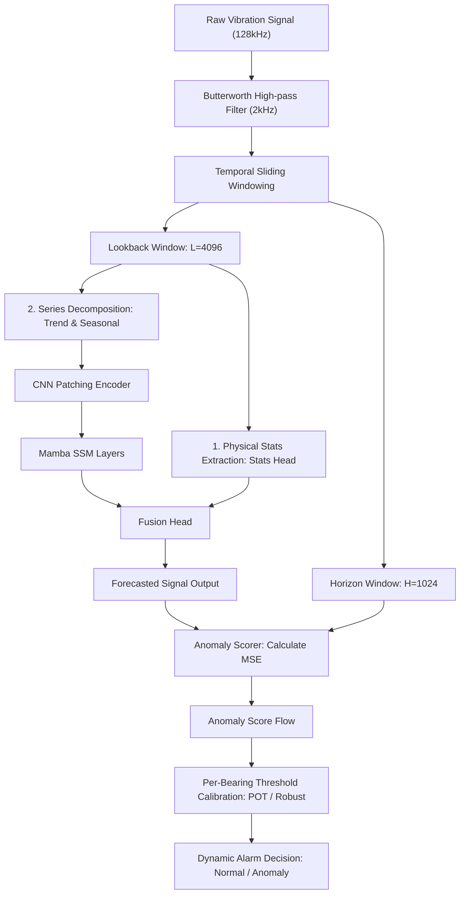

# 📂 Mô Tả Kiến Trúc Mã Nguồn (Source Code Description)

Tài liệu này mô tả chi tiết cấu trúc thư mục, chức năng của các mô-đun mã nguồn và luồng dữ liệu của hệ thống phát hiện bất thường dựa trên dự báo chuỗi thời gian.

---

## 1. 📂 Cấu Trúc Tổng Quan Thư Mục Mã Nguồn

```text
src/
├── data/                  # Tiền xử lý và quản lý tập dữ liệu
│   ├── dataset.py         # Lớp tải dữ liệu BearingDataset và MultiBearingDataset
│   └── pipeline.py        # Các hàm tiền xử lý dữ liệu và tạo bộ dữ liệu
├── models/                # Định nghĩa các kiến trúc mô hình học sâu
│   ├── mamba/             # Mô hình đề xuất lai Mamba-CNN và SimpleMamba
│   │   ├── hybrid_mamba.py       # Mô hình lai HybridMambaCNN (Đóng góp cốt lõi)
│   │   └── simple_mamba.py       # Kiến trúc Mamba thô đơn giản
│   └── baselines/         # Các mô hình đối chứng (LSTM, ModernTCN, PatchTST...)
│       ├── lstm.py
│       ├── tcn.py
│       ├── modern_tcn.py
│       └── patch_models.py
├── training/              # Vòng lặp huấn luyện, tối ưu và dừng sớm
│   ├── train.py           # Script chạy huấn luyện và tìm ngân sách tham số đối chứng
│   └── eval.py            # Script chạy đánh giá đa mô hình trên tập kiểm thử
├── evaluation/            # Các mô-đun tính toán chỉ số phát hiện bất thường và trực quan hóa
│   ├── anomaly_scorer.py  # Tính điểm bất thường (Anomaly Score) từ sai số dự báo
│   ├── metrics.py         # Cài đặt các thuật toán xác định ngưỡng (POT, Robust, GMM...)
│   ├── thresholding.py    # Phân tích thành phần GMM
│   ├── visualize_file.py  # Vẽ đồ thị điểm bất thường trên từng tệp
│   ├── visualize_trend.py # Vẽ đồ thị xu hướng lỗi trên tập test
│   └── visualize_full_lifecycle.py # Vẽ đồ thị xu hướng lỗi toàn bộ vòng đời vòng bi
└── utils/                 # Các tiện ích bổ trợ
```

---

## 2. 🧩 Chi Tiết Các Mô-đun và Lớp Cốt Lõi

### A. Mô-đun Tiền Xử Lý Dữ Liệu (`src/data/dataset.py`)

- **`BearingDataset`**: Quản lý dữ liệu của một vòng bi đơn lẻ.
  - *Lọc thông cao*: Áp dụng bộ lọc Butterworth thông cao (`highpass_freq: 2000` Hz) để triệt tiêu tần số thấp của động cơ nền, làm nổi bật các xung va đập tần số cao.
  - *Tính toán đặc trưng thống kê (Stats Head)*: Trích xuất **8 đặc trưng vật lý** từ cửa sổ lookback thô (không chuẩn hóa): **Mean, Std, RMS, Peak-to-Peak, Skewness, Kurtosis, Crest Factor, Shape Factor**. Biên độ tín hiệu tuyệt đối được giữ nguyên — chuẩn hóa z-score tức thời (instance normalization) bị loại bỏ hoàn toàn để tín hiệu suy thoái không bị triệt tiêu.
  - *Phân chia cửa sổ*: Trượt cửa sổ lookback (đầu vào) và horizon (nhãn dự báo) để chuẩn bị cho bài toán tự giám sát.
- **`MultiBearingDataset`**: Lớp bao bọc (Wrapper) kết hợp nhiều đối tượng `BearingDataset` để phục vụ huấn luyện mô hình trên đa thiết bị (Generalization).
  - *Ngăn ngừa rò rỉ nhãn*: Thông số điều kiện vận hành (`oc_stats`) được tính toán **chỉ trên tập đầu tiên** và truyền sang tập còn lại. Không có chuẩn hóa z-score nào được áp dụng lên tín hiệu rung — biên độ vật lý được bảo toàn hoàn toàn.

---

### B. Mô-đun Kiến Trúc Mô Hình đề xuất (`src/models/mamba/hybrid_mamba.py`)

- **`HybridMambaCNN`**: Trọng tâm nghiên cứu.
  1. **Series Decomposition (Phân rã chuỗi)**: Tín hiệu đầu vào được phân rã thành thành phần xu thế (`Trend`) thông qua bộ lọc trung bình trượt và thành phần chu kỳ (`Seasonal`).
  2. **Patching & CNN Encoder**: Thành phần Seasonal được cắt thành các đoạn nhỏ (Patches) và đưa qua các lớp tích chập 1D để trích xuất đặc trưng không gian cục bộ (Local Features).
  3. **Mamba Encoder Block**: Chuỗi đặc trưng sau tích chập được đưa qua các khối Mamba (State Space Model) để mô hình hóa mối quan hệ phụ thuộc xa (Long-range dependencies) với độ phức tạp tuyến tính $O(N)$.
  4. **Stats Projection Head & Fusion Head**: Nhánh Stats Head trích xuất đặc trưng vật lý trực tiếp từ chuỗi thô, đi qua một mạng tuyến tính chiếu (Projection Head), sau đó được ghép nối (Concatenate) với đầu ra của Mamba Encoder trước khi đưa vào lớp dự báo cuối cùng để đưa ra dự báo tín hiệu tương lai.

---

### C. Mô-đun Huấn Luyện & Dừng Sớm (`src/training/train.py`)

- **`train_one_model`**: Vòng lặp huấn luyện tối ưu hóa tham số mô hình.
  - *Hàm mất mát*: Sử dụng `HuberLoss` để nâng cao tính bền vững trước nhiễu gai.
  - *Tối ưu hóa tốc độ học*: Sử dụng `CosineAnnealingLR` kết hợp dừng sớm `EarlyStopping` dựa trên sai số của tập Validation.
- **Tự động co giãn tham số (`auto_scale_baselines`)**:
  - Tính toán tổng tham số của mô hình Mamba lai, sau đó tự động điều chỉnh tham số chiều ẩn của các baselines (LSTM, ModernTCN, PatchTST, SimpleMamba) tương ứng để đảm bảo tính công bằng thực nghiệm.

---

## 3. 🔄 Luồng Dữ Liệu Hoạt Động (Data Pipeline Flow)

Sơ đồ dưới đây mô tả luồng xử lý dữ liệu:


